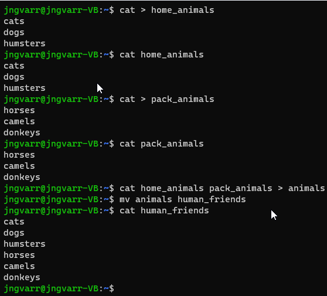
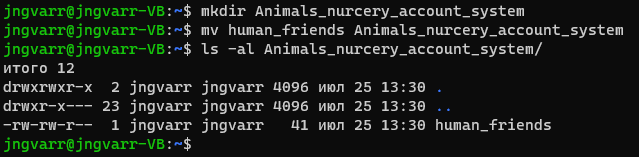
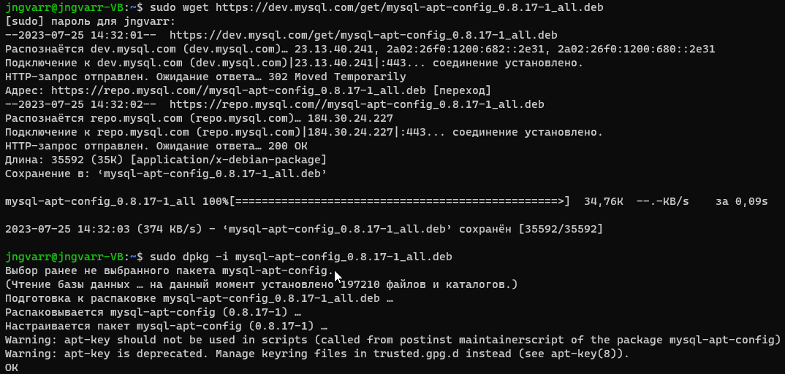
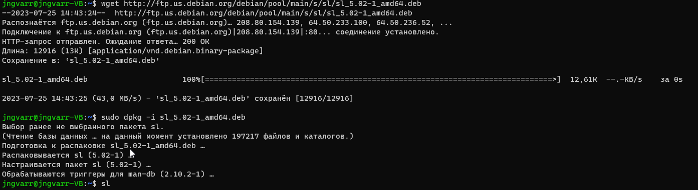
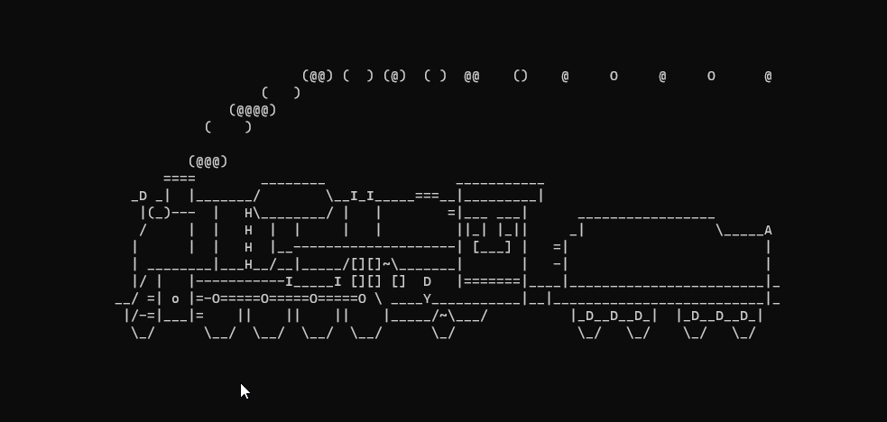
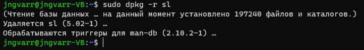
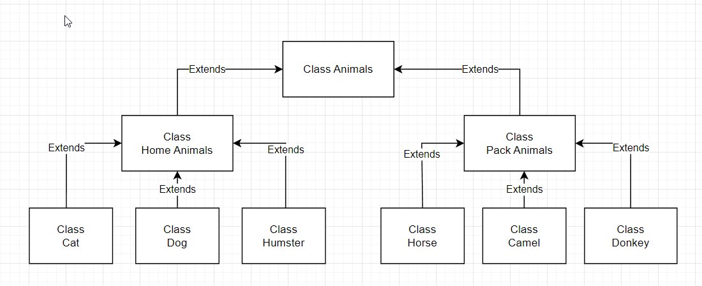

# *Итоговая контрольная работа*

## Информация о проекте:

_**Необходимо организовать систему учета для питомника в котором живут
домашние и вьючные животные.**_

### Задание:
**1. Используя команду cat в терминале операционной системы Linux, создать
   два файла Домашние животные (заполнив файл собаками, кошками,
   хомяками) и Вьючные животными заполнив файл Лошадьми, верблюдами и
   ослы), а затем объединить их. Просмотреть содержимое созданного файла.
   Переименовать файл, дав ему новое имя (Друзья человека).**
      

**2. Создать директорию, переместить файл туда.**
      

**3. Подключить дополнительный репозиторий MySQL.**
      
   **Установить любой пакет из этого репозитория.**
      

**4. Установить и удалить deb-пакет с помощью dpkg.**
**Установлен пакет sl**
      
      
**Удален пакет sl**
      
**5. Выложить историю команд в терминале ubuntu:**
      
      cat > home_animals
      cat > pack_animals
      cat home_animals pack_animals > animals 
      mv animals human_friends
      cat human_friends
      mkdir Animals_nurcery_account_system
      mv human_friends Animals_nurcery_account_system

      sudo wget https://dev.mysql.com/get/mysql-apt-config_0.8.17-1_all.deb
      sudo dpkg -i mysql-apt-config_0.8.17-1_all.deb
      sudo apt-get update 
      sudo apt-get install mysql-server
      wget http://ftp.us.debian.org/debian/pool/main/s/sl/sl_5.02-1_amd64.deb
      sudo dpkg -i sl_5.02-1_amd64.deb
      sudo dpkg -r sl

**6. Нарисовать диаграмму, в которой есть класс родительский класс, домашние
   животные и вьючные животные, в составы которых в случае домашних
   животных войдут классы: собаки, кошки, хомяки, а в класс вьючные животные
   войдут: Лошади, верблюды и ослы).**

   

**7. В подключенном MySQL репозитории создать базу данных “Друзья
   человека”**
    
    CREATE DATABASE Human_friends;
    USE Human_friends;

**8. Создать таблицы с иерархией из диаграммы в БД**

**9. Заполнить низкоуровневые таблицы именами(животных), командами
которые они выполняют и датами рождения**

    CREATE TABLE animals
    (
        Id INT AUTO_INCREMENT PRIMARY KEY,
        animals_type VARCHAR(20) unique
    );

    INSERT animals (animals_type)
    VALUES ('вьючные'), ('домашние'); 

    CREATE TABLE pack_animals
    (
        Id INT AUTO_INCREMENT PRIMARY KEY, 
        friends_name VARCHAR (20) unique, 
        animals_type VARCHAR(20), 
        FOREIGN KEY (animals_type) REFERENCES animals (animals_type) ON DELETE CASCADE ON UPDATE CASCADE
    );
    INSERT pack_animals (friends_name, animals_type)
    VALUES('Лошади', 'вьючные'),('Ослы', 'вьючные'),('Верблюды', 'вьючные');    
    
    CREATE TABLE home_animals
    ( 
        Id INT AUTO_INCREMENT PRIMARY KEY, 
        friends_name VARCHAR (20) unique, 
        animals_type VARCHAR(20), 
        FOREIGN KEY (animals_type) REFERENCES animals (animals_type) ON DELETE CASCADE ON UPDATE CASCADE
    );
    
    INSERT home_animals (friends_name, animals_type)
    VALUES ('Кошки', 'домашние'),('Собаки', 'домашние'),  ('Хомяки', 'домашние');

    CREATE TABLE cats 
    (
        Id INT AUTO_INCREMENT PRIMARY KEY, 
        Name VARCHAR(20),day_of_birth DATE,
        commands VARCHAR(50), 
        friends_name VARCHAR (20),
        Foreign KEY (friends_name) REFERENCES home_animals (friends_name) ON DELETE CASCADE ON UPDATE CASCADE
    );

    INSERT  cats (Name, day_of_birth, commands, friends_name)
    VALUES  ('Васька', '2019-01-01', 'кис-кис-кис', 'Кошки'),
            ('Барсик', '2018-12-31', "Пшшшшшш!", 'Кошки'),  
            ('Мурзик', '2017-06-30', "Брысь!!!!!", 'Кошки');

    CREATE TABLE dogs 
    (
        Id INT AUTO_INCREMENT PRIMARY KEY, 
        Name VARCHAR(20),day_of_birth DATE,
        commands VARCHAR(50),
        friends_name VARCHAR (20),
        Foreign KEY (friends_name) REFERENCES home_animals (friends_name) ON DELETE CASCADE ON UPDATE CASCADE
    );

    INSERT  dogs (Name, day_of_birth, commands, friends_name) 
    VALUES  ('Тузик', '2000-01-01', 'Сидеть! Лежать! Голос!', 'Собаки'), 
            ('Бобик', '2020-07-31', "К ноге! Рядом! Место!", 'Собаки'), 
            ('Шарик', '2022-07-21', "Чужой! Взять! Фас!", 'Собаки');

    CREATE TABLE hamsters 
    (
        Id INT AUTO_INCREMENT PRIMARY KEY, Name VARCHAR(20),
        day_of_birth DATE,commands VARCHAR(50),
        friends_name VARCHAR (20),
        Foreign KEY (friends_name) REFERENCES home_animals (friends_name) ON DELETE CASCADE ON UPDATE CASCADE
    );

    INSERT hamsters (Name, day_of_birth, commands, friends_name)
    VALUES  ('Хома', '2022-12-01',"", 'Хомяки'),
            ('Жора', '2023-05-31', "", 'Хомяки'),
            ('Жома', '2023-07-21', "", 'Хомяки');

    CREATE TABLE horses 
    (
        Id INT AUTO_INCREMENT PRIMARY KEY, Name VARCHAR(20),
        day_of_birth DATE,commands VARCHAR(50),
        friends_name VARCHAR (20),
        Foreign KEY (friends_name) REFERENCES pack_animals (friends_name) ON DELETE CASCADE ON UPDATE CASCADE
    );

    INSERT horses (Name, day_of_birth, commands, friends_name)
    VALUES  ('Сивка', '2015-11-15',"Но! Тпру!", 'Лошади'),
            ('Бурка', '2017-07-17', "Пошла! Стоять!", 'Лошади'),
            ('Каурка', '2012-12-12', "ЙаааХааа! УУУуУУУ!", 'Лошади');

    CREATE TABLE camels 
    (
        Id INT AUTO_INCREMENT PRIMARY KEY, Name VARCHAR(20),
        day_of_birth DATE,commands VARCHAR(50),
        friends_name VARCHAR (20),
        Foreign KEY (friends_name) REFERENCES pack_animals (friends_name) ON DELETE CASCADE ON UPDATE CASCADE
    );

    INSERT  camels (Name, day_of_birth, commands, friends_name)
    VALUES  ('Вася', '2016-08-24',"Но! Тпру!", 'Верблюды'),
            ('Али', '2010-05-15', "Пошла! Стоять!", 'Верблюды'),
            ('Хосе', '2011-11-11', "ЙаааХааа! УУУуУУУ!", 'Верблюды');

    CREATE TABLE donkeys 
    (
        Id INT AUTO_INCREMENT PRIMARY KEY, Name VARCHAR(20),
        day_of_birth DATE,commands VARCHAR(50),
        friends_name VARCHAR (20),
        Foreign KEY (friends_name) REFERENCES pack_animals (friends_name) ON DELETE CASCADE ON UPDATE CASCADE
    );

    INSERT donkeys (Name, day_of_birth, commands, friends_name)
    VALUES  ('Иа', '2011-12-13',"Быстрее! Еще быстрее!", 'Ослы'),
            ('Ио', '2010-09-08', "Шевелись!", 'Ослы'),
            ('Шеф', '2009-10-09', "ЙаааХааа! УУУуУУУ!", 'Ослы');   
**10. Удалив из таблицы верблюдов, т.к. верблюдов решили перевезти в другой
    питомник на зимовку. Объединить таблицы лошади, и ослы в одну таблицу.**
        
    DELETE FROM camels;

    CREATE TABLE all_pack_animals AS
    SELECT name, day_of_birth, commands FROM horses
    UNION SELECT  name, day_of_birth, commands FROM donkeys;
    ALTER TABLE all_pack_animals
    ADD id INT AUTO_INCREMENT PRIMARY KEY FIRST;

**11.Создать новую таблицу “молодые животные” в которую попадут все
животные старше 1 года, но младше 3 лет и в отдельном столбце с точностью
до месяца подсчитать возраст животных в новой таблице**
    
    CREATE TABLe young_animal AS
    SELECT *, TIMESTAMPDIFF(MONTH, day_of_birth, CURDATE()) AS age_in_month
    FROM (SELECT * FROM horses
    UNION SELECT * FROM donkeys
    UNION SELECT * FROM dogs
    UNION SELECT * FROM cats
    UNION SELECT * FROM hamsters) AS animal
    WHERE day_of_birth BETWEEN ADDDATE(curdate(), INTERVAL -3 YEAR) AND ADDDATE(CURDATE(), INTERVAL -1 YEAR);
**12. Объединить все таблицы в одну, при этом сохраняя поля, указывающие на
    прошлую принадлежность к старым таблицам.**

    CREATE TABLe all_animals AS
    SELECT * FROM horses
    UNION SELECT * FROM donkeys
    UNION SELECT * FROM dogs
    UNION SELECT * FROM cats
    UNION SELECT * FROM hamsters;
    ALTER TABLE all_animals DROP COLUMN Id;
    ALTER TABLE all_animals ADD id INT AUTO_INCREMENT PRIMARY KEY FIRST;

**13.Создать класс с Инкапсуляцией методов и наследованием по диаграмме.**

**14. Написать программу, имитирующую работу реестра домашних животных.
    В программе должен быть реализован следующий функционал:

- 14.1 Завести новое животное**
- 14.2 определять животное в правильный класс
- 14.3 увидеть список команд, которое выполняет животное
- 14.4 обучить животное новым командам
- 14.5 Реализовать навигацию по меню

**15.Создайте класс Счетчик, у которого есть метод add(), увеличивающий̆
    значение внутренней int переменно на 1 при нажатие “Завести новое
    животное” 
    Сделайте так, чтобы с объектом такого типа можно было работать в
    блоке try-with-resources. Нужно бросить исключение, если работа с объектом
    типа счетчик была не в ресурсном try и/или ресурс остался открыт. Значение
    считать в ресурсе try, если при заведения животного заполнены все поля.**